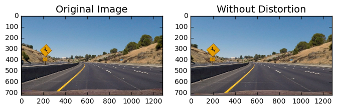
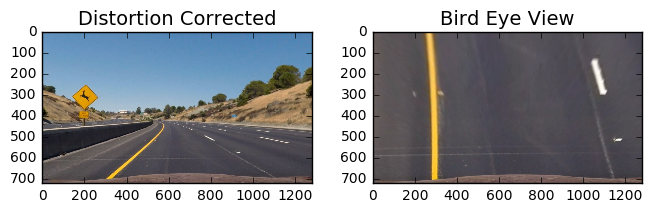
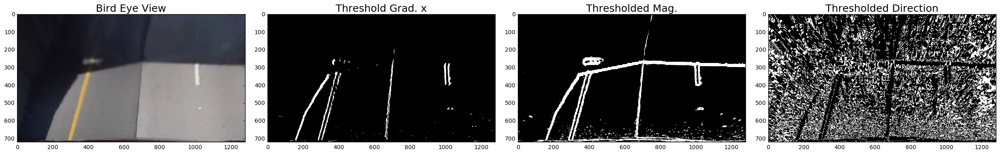
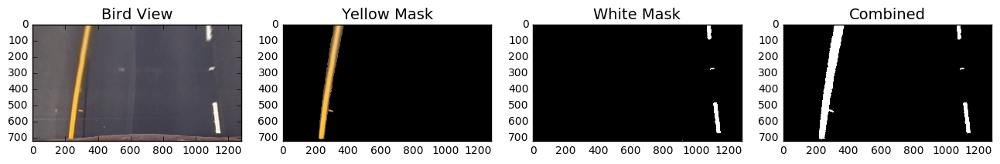
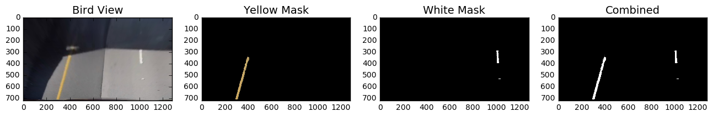
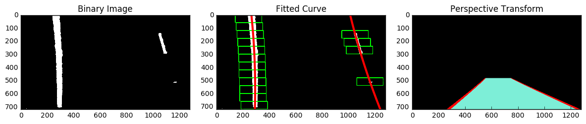
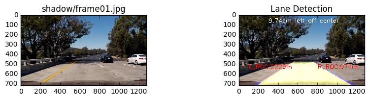
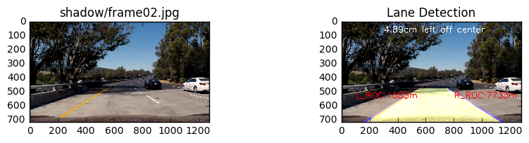
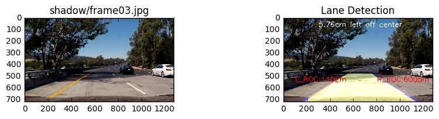

# P4: Advanced Lane Finding


In this project, we put the computer vision based lane finding technique to use.  We take images captured from the front-mounted camera as input and mark the lanes and the area between the lanes.  In particular, we implement the following techniques and tasks:

* Compute the camera calibration matrix and distortion coefficients given a set of chessboard images.
* Apply a distortion correction to raw images.
* Use color transforms, gradients, etc., to create a thresholded binary image.
* Apply a perspective transform to rectify binary image ("birds-eye view").
* Detect lane pixels and fit to find the lane boundary.
* Determine the curvature of the lane and vehicle position with respect to center.
* Warp the detected lane boundaries back onto the original image.
* Output visual display of the lane boundaries and numerical estimation of lane curvature and vehicle position.


### Submitted Files

The main files per the requirement include:

* advanced\_lane\_finding.ipynb - the Ipython notebook that includes all the  functions that implement distortion correction, perspective transform, binary thresholding, lane detection and line fitting. The function pipeline(img) executes all the tasks related to the lane finding. 
* sub\_projcet\_video.mp4 and sub\_challenge\_video.mp4 - the video files that show the detected lanes and curvature and offset information.
* I also attach some images captured from the videos. They are saved in the directory \shadow and \bridge.
* Calibration and test images provided by Udacity, saved in directory \camera_cal and \test_images, respectively. 

### My Approaches

The lane detection pipeline includes the following main steps:

1. Camera calibration
2. Image distortion removal 
3. Image perspective transform
4. Binary thresholding
5. Lane detection, curve-fitting, and simple sanity check.
6. Plotting the detected lane and perspective transform (back to the image)

#### Camera calibration

In the first step, we compute the camera calibration matrix and distortion coefficients given a set of chessboard images take from different perspectives. Following the course instruction, I use the OpenCV function cv2.findChessBoardCorners() to find the x,y coordinates of each corner on a
given image. Once I have an array with all these corners, I use the OpenCV cv2.calibrateCamera() function to calculate the camera matrix, the vector of distortion coefficients.

#### Image distortion removal

Once the camera is calibrated, we apply the camera matrix and distortion
coefficients to correct distortion effects on camera input images. This is done using the OpenCV  cv2.undistort() function. The following shows the before and after distortion removal:



#### Image perspective transform
I apply a perspective transform on the image to
generate a bird eye view. In particular, I first choose source and destination points and use the OpenCV cv2.getPerspectiveTransform()function to generates a perspective transform matrix. Next I use the OpenCV cv2.warpPerspective() function with the obtained transform matrix. The following shows the before and after perspective transform:


#### Binary thresholding

There are many techniques suggested by the course. These approaches fall into two categories: gradient-based and color space -based. In the process of implementing these techniques, I find that the gradient-based approach is less robust. For example, the following example shows that gradient-based approaches by themselves are not robust in situations of shadows or uneven pavement color. It often picks up unwanted lines from the shadows and color transitions (uneven color of the road). These elements tend to complicate the lane detection process.



After much trial and error, I come up with an color-space-only approach. This approach uses channel information from the HSV space and RGB space to pick out yellow and white color, respectively. For picking out the left yellow line, I set low and high thresholds, yellow\_hsv\_low, yellow\_hsv\_high, respectively. I then use OpenCV cv2.inRange(hsv, yellow\_hsv\_low, yellow\_hsv\_high) function, with hsv as in image in HSV space. To pick out the white color, I use a threshold on the B (blue) channel in RGB space. Then I combine the left and right elements into the final thresholded binary image. The following images illustrate the process:

This approach is robust enough in picking out the lane lines, even in the presence of shadows and uneven pavement color. In addition, with proper thresholding, the results much less "noisy" than the gradient-based approach.


#### Detect, fit, and plot the lane lines
After applying calibration, thresholding, and a perspective transform to a road image, we have a binary image for the lane lines lane lines. In this section, we first detect explicitly which pixels belong to left or right line. We then fit both lines with the 2nd order polynomial, check if the fitted results are reasonable, and plot the fitted curves. These steps are implemented in the function detect\_fit\_plot(binary).
##### Lane detection and fitting
I implement two functions that identify the pixels belong to left and right lanes. The first one full\_scan () is a histogram-based approach. We scan the binary image from top to the bottom using a rectangle stripe. The length of the rectangle is the image length and the height is a design parameters. For each scan, we calculate the histogram along all the columns in the scanned area. We use the two most prominent peaks in this histogram as bases for left and right lanes. We then search all the pixels that fall into boxes that centers on the base positions.
The following images illustrate this approach:

The second function simple\_scan() relies on previous line fitting result. If we fit both lanes successfully in one frame of video, in the next frame we can simplify the task by searching in a margin around the previous fitted line positions.

##### Curve fitting and sanity check
Line fitting is straight forward with np.polyfit(x, y, 2). I also use following "rule of thumb" to make sanity check on the left and right lanes.

* Radius curvature shall not be too large or too small.
* The coordinates of the top and bottom intercepts shall fall into the range of [0, 640] or [640, 1280] for left and right lanes, respectively.
* The bottom x-intercept shall not deviate too match from that of the previous frame.

The functions check\_fit\_result\_left() and check\_fit\_result_right() implement the sanity check for the left and right lanes,respectively.

##### Plot the curves.

Plotting the fitted curves and coloring the area between two lanes are straight forward with OpenCV functions cv2.polylines() and cv2.fillPoly(). In addition, I use perspective transform again to convert the bird eye view to the camera view. Finally, I overlay the plotted lanes onto the image. I also display information such as radius of curvature and offset in the final image.

##### Curvature and offset estimation
The radius curvature is estimated in fit_lane() function using the formula provided by the course. 

```
# Fit with "meters"    
    fit_cr = np.polyfit(y*y_m_pix, x*x_m_pix, 2)
# Calculate radius of curvature
    roc = ((1 + (2*fit_cr[0]*np.max(y)*y_m_pix + fit_cr[1])**2)**1.5)/np.absolute(2*fit_cr[0])
```

The offset is estimated at the end of the detect\_fit\_plot(binary).

```
offset = ((l_x_intcep[1]+r_x_intcep[1])/2-binary.shape[1]/2)*(3.7/(r_x_intcep[1]-l_x_intcep[1])) 
```
The function display_info() display ROC and offset information in the video.

### Pipeline and Final Results
Before testing on the video, I run the pipeline() on a sequence of images to make sure that the end-to-end lane finding works.



The final video files are included in the submitted files. A YouTube link is also provided: 


[Processed project video](https://youtu.be/6Bv9Cw4bS1s)

[Processed challenge video](https://youtu.be/lIRk0NC5YXI)


### Future Improvement

I plan to implement frame averaging to smooth out occasional bumpy frame-to-frame transition. 